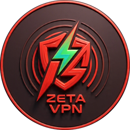

<div align="center">



# ZetaVPN

**An all-in-one, self-hosted VPN / proxy panel — every protocol, one command, one portal.**

<sub>**by Muhammad Owais**</sub>

[](https://github.com/M-Owais-Arshad/Zeta-Vpn/actions/workflows/ci.yml)
&nbsp;
&nbsp;

ZetaVPN turns a fresh Debian/Ubuntu VPS into a full proxy server managed from a modern
web dashboard: **Xray-core** + **sing-box** + a complete **SSH tunnelling stack**, wired
together by a FastAPI backend and installed straight from GitHub.

`VLESS · VMess · Trojan · Shadowsocks-2022 · REALITY · Hysteria2 · TUIC · SSH-WS · SSH-SSL · Dropbear`

</div>

---

## ✨ Highlights

- **All the protocols, two cores.** Xray-core serves VLESS (REALITY + XTLS-Vision), VMess,
  Trojan, Shadowsocks-2022, SOCKS and HTTP; sing-box adds the QUIC generation — Hysteria2 and
  TUIC. A native SSH tunnelling stack (OpenSSH, Dropbear, stunnel/SSL, WebSocket) rounds it out.
- **One-command install from GitHub.** `curl | bash` detects your arch, pulls the core binaries
  from their official releases, sets up systemd services, nginx, TLS (acme.sh), BBR and a firewall.
- **A real web portal — no build step.** A clean, dark, responsive dashboard (framework-free,
  zero npm) to manage inbounds, clients, traffic quotas, expiry, SSH accounts and settings, plus a
  self-service **user subscription page**.
- **Smart subscriptions.** One subscription URL serves **base64** (v2rayN/Hiddify),
  **Clash/Mihomo YAML** (Clash Verge) and **sing-box JSON** (NekoBox) — auto-detected per client,
  with the `Subscription-Userinfo` quota/expiry header and per-config QR codes.
- **Secure by default.** Randomised admin credentials and a secret panel path at install, bcrypt
  hashing, TOTP 2FA, login brute-force lockout, session revocation on password change, verified
  binary downloads, fail2ban + ufw. No default passwords, ever.
- **`zeta` CLI.** A terminal menu for status, restarts, updates, backups and quick SSH accounts.

---

## 🚀 Setup guide — from zero to running

> **New to Linux/VPS? Follow every step below — each command is copy-paste ready and explained.**
> Already comfortable? The one-liner in **Step 3** is all you need.

### What you need first

- A **VPS** (a rented Linux server) running a **fresh Debian 11/12** or **Ubuntu 20.04 / 22.04 / 24.04**, with at least **512 MB RAM**. Any provider works — DigitalOcean, Vultr, Hetzner, Linode, AWS Lightsail, etc.
- The server's **public IP address** and its **root password** (your provider shows these when you create it).
- *(Optional but recommended)* a **domain name** (e.g. `vpn.example.com`) with its **A record pointed to your server's IP**. A domain unlocks HTTPS + the TLS protocols (REALITY, Trojan, Hysteria2, TUIC).

---

### Step 1 — Connect to your server

From **your own computer's** terminal (Windows: PowerShell or Windows Terminal · macOS/Linux: Terminal), open an SSH connection. Replace `YOUR_SERVER_IP` with your server's IP:

```bash
ssh root@YOUR_SERVER_IP
```

The first time it asks *"Are you sure you want to continue connecting?"* — type `yes` and press Enter, then type your root password (the screen stays blank while typing — that's normal).

---

### Step 2 — Update the server (recommended)

Refresh the package list and install the latest security updates before you begin:

```bash
apt update && apt upgrade -y
```

---

### Step 3 — Install ZetaVPN (one command)

This downloads and runs the installer. It sets up Xray, sing-box, the SSH stack, nginx, the web panel, a firewall and BBR — automatically. It takes about **2–5 minutes**; answer the confirmation prompt with `y`:

```bash
bash <(curl -fsSL https://raw.githubusercontent.com/M-Owais-Arshad/Zeta-Vpn/main/install.sh)
```

**Have a domain? Use this instead** (point the domain's A record to your IP first). It also gets a free Let's Encrypt HTTPS certificate. Replace `vpn.example.com` with your domain:

```bash
ZETA_DOMAIN=vpn.example.com ZETA_YES=1 bash <(curl -fsSL https://raw.githubusercontent.com/M-Owais-Arshad/Zeta-Vpn/main/install.sh)
```

> Prefer to inspect the code first? Clone and run it locally instead:
> ```bash
> git clone https://github.com/M-Owais-Arshad/Zeta-Vpn.git
> ```
> ```bash
> cd Zeta-Vpn && sudo ./install.sh
> ```

---

### Step 4 — Save your login details

When the installer finishes it prints a box with your **Panel URL**, **Username** and **Password**. **Copy all three somewhere safe** — the URL contains a secret path you cannot guess back.

Lost them, or want to see them again later? Run:

```bash
zeta info
```

---

### Step 5 — Open the panel and secure it

Open the **Panel URL** in your browser and sign in. Then go straight to **Settings → Security** and:

1. Set a strong password → **Update password**.
2. Turn on two-factor auth → **Set up 2FA** → scan the QR with Google Authenticator / Aegis → enter the 6-digit code → **Enable**.

If you used a domain, also set it under **Settings → Server identity → Server domain** so share links use your domain instead of the raw IP.

---

### Step 6 — Create your first inbound (a protocol)

Go to **Inbounds → Add inbound**. Beginners: pick **VLESS + REALITY** (best for strict networks — needs a domain) or **VMess / WebSocket** (simplest to start). Keep the suggested port or set your own, then **Save**.

---

### Step 7 — Create a user (client)

Open the inbound you just made → **Add client** → give it a name, and optionally a **data limit** and **expiry date** → **Save**.

---

### Step 8 — Connect a device

Click the client's **Share** button. You get a config link, a **QR code**, and a **subscription URL**:

- **Phone (Android):** install **Hiddify** or **NekoBox**, then scan the QR or paste the subscription URL.
- **Windows:** install **v2rayN**, then import the subscription URL.
- **iPhone:** install **Streisand** or **Shadowrocket**, then add the subscription URL.

That's it — you're connected. 🎉

---

### Everyday management commands

Open the interactive menu:

```bash
zeta
```

Check that every service is healthy:

```bash
zeta status
```

Show the panel URL + login details again:

```bash
zeta info
```

Restart everything (panel + cores + nginx):

```bash
zeta restart all
```

Save a backup (database + config) to `/root`:

```bash
zeta backup
```

Update to the latest version and restart:

```bash
zeta update
```

---

### If the panel won't open

First, re-check the services:

```bash
zeta status
```

Look at the panel's recent logs for errors:

```bash
journalctl -u zeta-panel -n 50 --no-pager
```

Still stuck? Make sure your **VPS provider's firewall / security group** allows inbound ports **80** and **443** (panel + HTTPS) and **22** (SSH) — a blocked cloud firewall is the most common cause.

---

## 🧭 What gets installed

| Component | Where | Service |
|---|---|---|
| Panel (FastAPI) | `/opt/zetavpn` | `zeta-panel` |
| Xray-core | `/usr/local/bin/xray` | `zeta-xray` |
| sing-box | `/usr/local/bin/sing-box` | `zeta-singbox` |
| SSH-over-WebSocket proxy | `/opt/zetavpn/proxies/ws-proxy.py` | `zeta-ws` |
| Dropbear / stunnel | system | `dropbear` / `stunnel4` |
| nginx reverse proxy | `/etc/nginx/conf.d/zeta.conf` | `nginx` |
| CLI manager | `/usr/local/bin/zeta` | — |

Default ports: **panel** `2096` · **SSH** `22`, `143`/`149` (Dropbear), `445` (SSL), `8880` (WS) ·
proxy inbounds on whatever ports you choose in the panel.

---

## 🖥️ Using it

**Panel** — Dashboard (live CPU/RAM/disk + network chart + service health), Inbounds
(create/enable/delete, manage clients), SSH Accounts, Settings (server identity, password, 2FA,
core reload).

**Create a client** → open its **Share** dialog for the config URI, a QR code, the subscription URL
and a link to the user portal.

**User portal** — `https://your.domain/portal?id=<sub_id>` shows a user their configs, QR codes,
usage and expiry, and a one-tap subscription import URL.

**CLI** — run `zeta` for the interactive menu, or:

```bash
zeta status          # service health
zeta restart all     # restart panel + cores + nginx
zeta info            # panel URL & credentials
zeta update          # git pull + deps + restart
zeta backup          # tar up data + .env
```

---

## 📚 Documentation

| Doc | What's in it |
|---|---|
| [docs/INSTALL.md](docs/INSTALL.md) | Full install guide, env vars, domains, updating, uninstall |
| [docs/ARCHITECTURE.md](docs/ARCHITECTURE.md) | How the panel, cores, DB and services fit together |
| [docs/PROTOCOLS.md](docs/PROTOCOLS.md) | Every protocol, transport, and how to configure it |
| [docs/API.md](docs/API.md) | REST API + subscription endpoint reference |
| [docs/SECURITY.md](docs/SECURITY.md) | Threat model, hardening defaults, and known CVE classes |

---

## 🗂️ Project layout

```
zetavpn/
├── install.sh              # one-command bootstrap
├── bin/zeta                # CLI manager
├── backend/                # FastAPI panel (Python)
│   └── zeta/
│       ├── api/            # REST routers (auth, inbounds, clients, ssh, system, sub, settings)
│       ├── core/           # xray, singbox, links, clientconf, protocols, ssh_manager, stats
│       ├── models.py schemas.py auth.py deps.py tasks.py bootstrap.py main.py config.py db.py
├── frontend/               # no-build web UI (HTML + vanilla JS + CSS)
├── scripts/                # modular installers (xray, singbox, ssh, nginx, ssl, bbr, firewall)
├── systemd/                # zeta-panel / zeta-xray / zeta-singbox / zeta-ws units
├── proxies/ws-proxy.py     # SSH-over-WebSocket proxy
├── config/templates/       # reference inbound JSON for each protocol
└── docs/                   # documentation
```

---

## 🔒 Security in one line

The panel manages system users and services, so it runs privileged — but ships **no default
credentials**, a **secret URL path**, **2FA**, **brute-force lockout**, **verified downloads**,
**fail2ban** and **ufw** enabled out of the box. Read [docs/SECURITY.md](docs/SECURITY.md) before
exposing it to the internet, and always put it behind a domain + TLS.

## ⚖️ License & responsible use

**ZetaVPN by Muhammad Owais** — licensed under **AGPL-3.0** (see [LICENSE](LICENSE)).
You're free to use, self-host and modify it, but if you run a modified version — including as a
network service — you must **publish your source and keep clear attribution to the original author,
Muhammad Owais**. Forks are welcome under those terms.

ZetaVPN is for running **your own** servers and providing access to users you are authorised to
serve. You are responsible for complying with the laws and terms that apply to you. Built on the
excellent open-source [Xray-core](https://github.com/XTLS/Xray-core) and
[sing-box](https://github.com/SagerNet/sing-box).

<div align="center"><sub><b>ZetaVPN</b> by Muhammad Owais · © 2026 · AGPL-3.0</sub></div>
